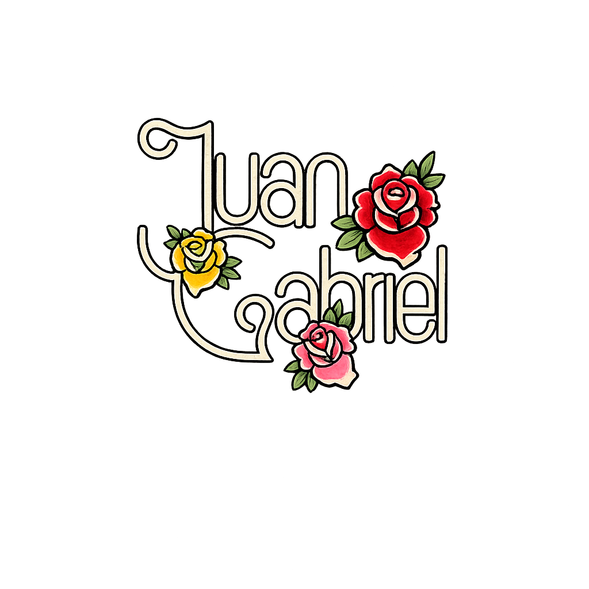

# Juan Gabriel

  

  

Proyecto personal en homenaje a Juan Gabriel.
La página reúne material del maestro Alberto Aguilera Valadez de manera respetuosa a su legado.

## 📁 Estructura de archivos CSS

- **`css/reset.css`**: Estilos de reinicio global y configuración base del documento
- **`css/base.css`**: Estilos base, componentes comunes (botones, títulos, contenedores)
- **`css/header.css`**: Estilos del encabezado y logo
- **`css/footer.css`**: Estilos del pie de página, bloque de plataformas y firma
- **`css/navigation.css`**: Estilos del menú de navegación
- **`css/carousel.css`**: Estilos del carrusel multimedia
- **`css/multimedia.css`**: Estilos de multimedia, fotos icónicas, YouTube
- **`css/discografia.css`**: Estilos de la sección de discografía
- **`css/responsive.css`**: Media queries y estilos responsivos
- **`css/animations.css`**: Animaciones y keyframes

> “Muy feliz fui contigo, me conformé con nada  
> y hoy te quedas sin mí”

## Nota personal
Un homenaje digital a Juan Gabriel 💛