# Juan Gabriel

  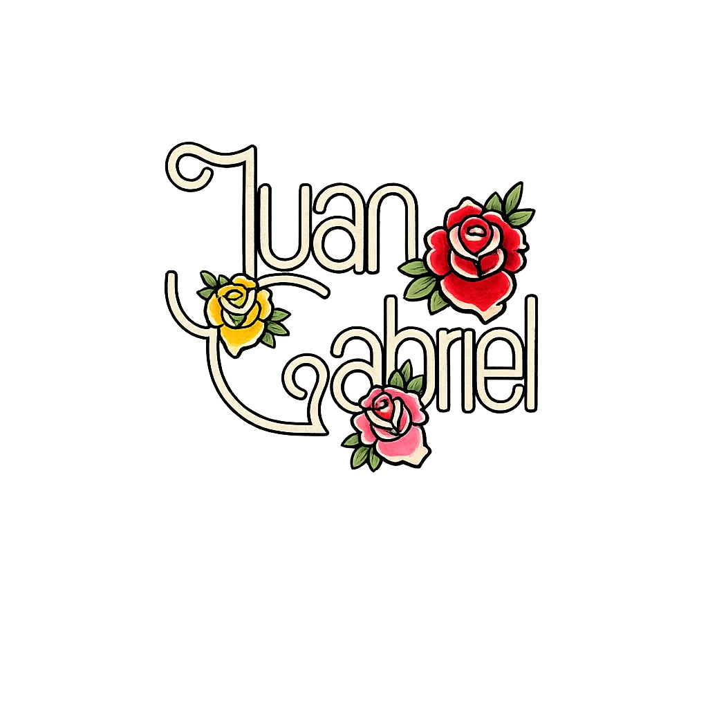

  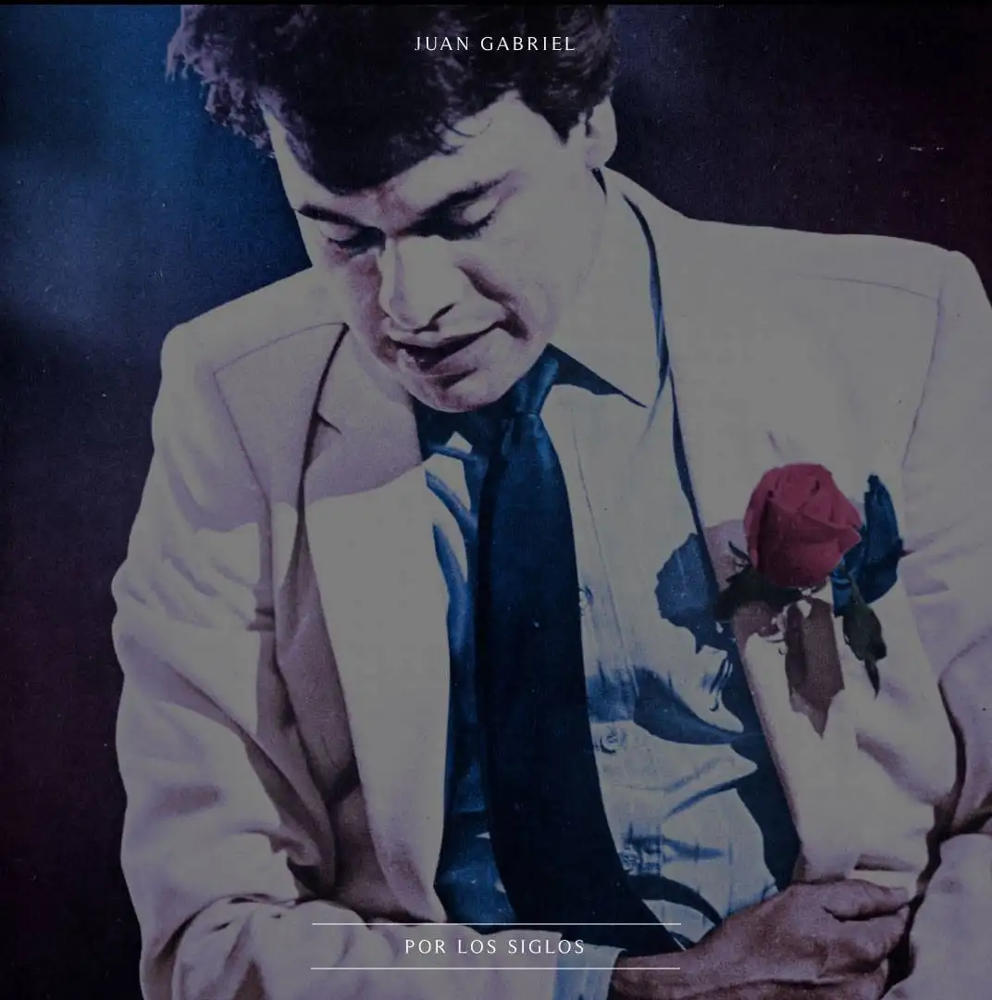

Proyecto personal en homenaje a Juan Gabriel.
La página reúne material del maestro Alberto Aguilera Valadez de manera respetuosa a su legado.

> “Muy feliz fui contigo, me conformé con nada  
> y hoy te quedas sin mí”

## Nota personal
Un homenaje digital a Juan Gabriel 💛

## Capturas

  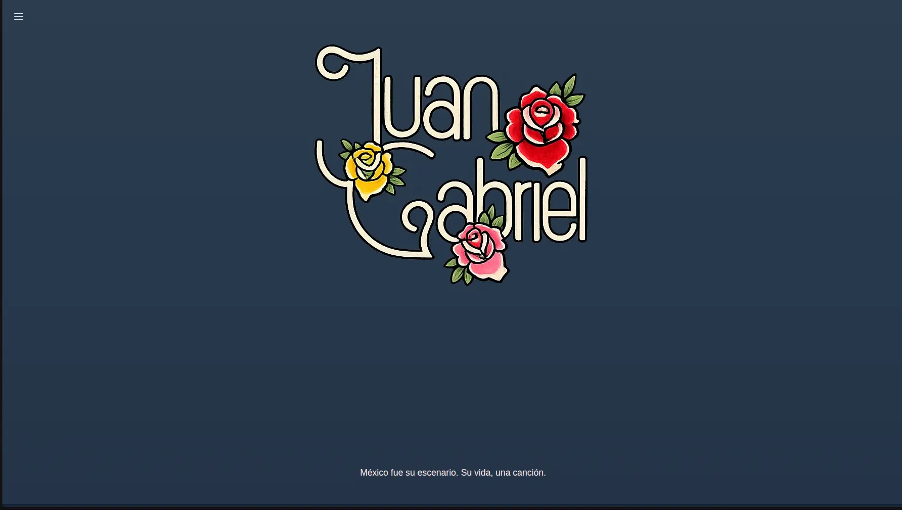

  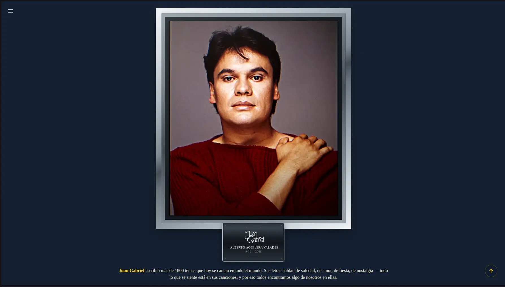

  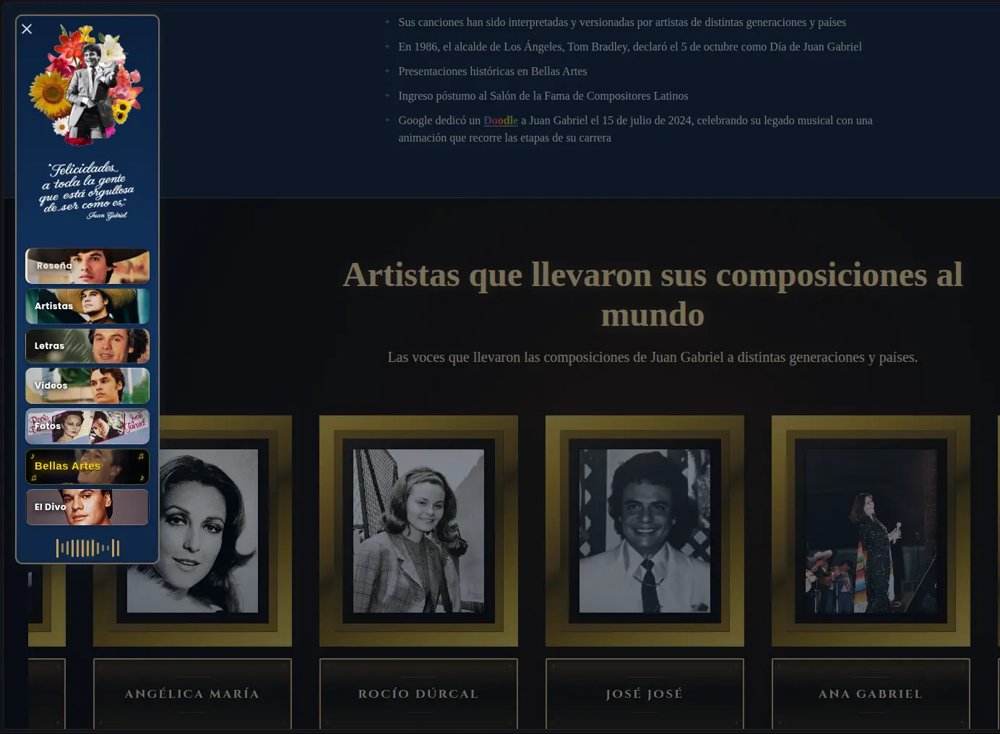

  

  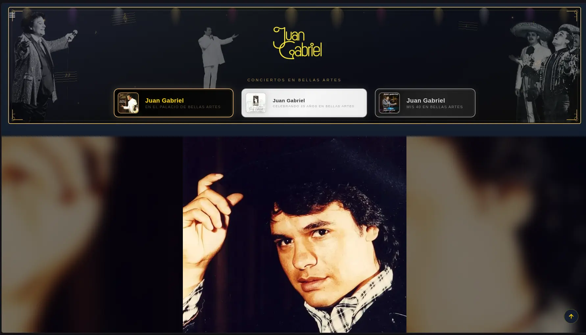

  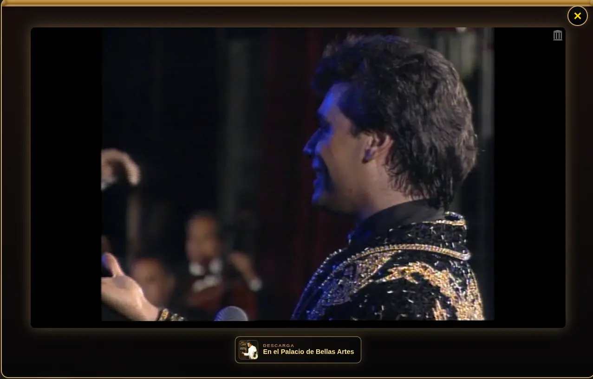
  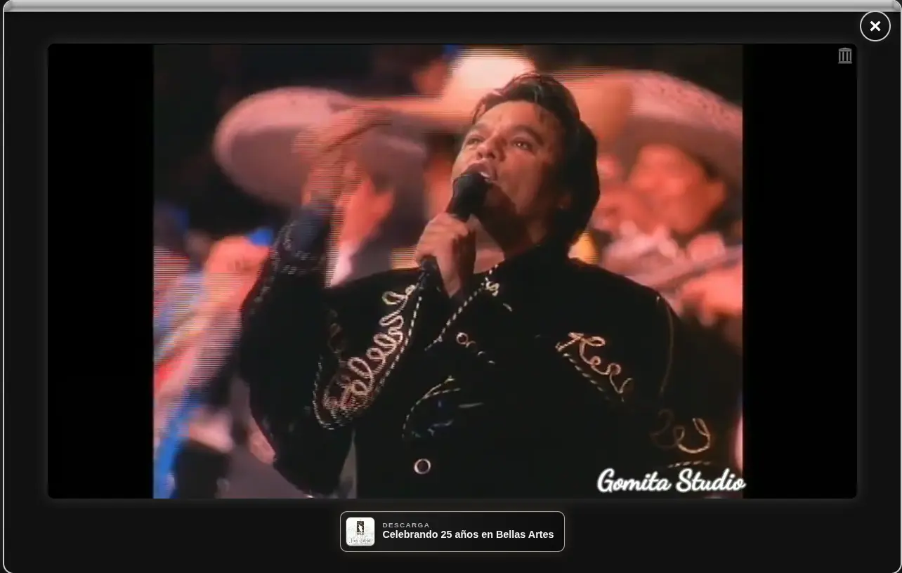
  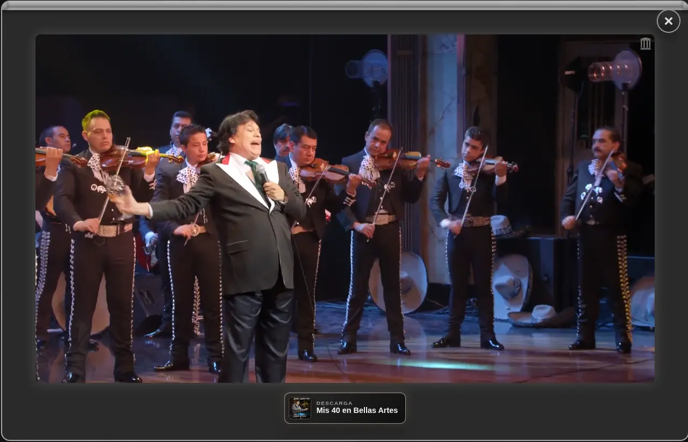

  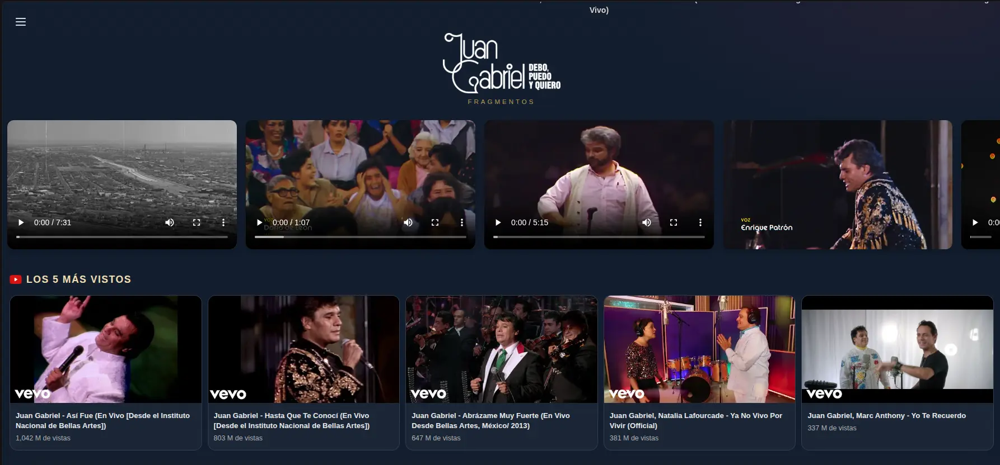

  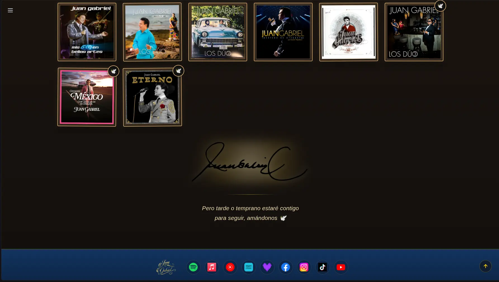

